WildcatV5.6 for HW 2.72 and older DEVICES ONLY
=
WildcatV6.5 for HW 2.81 and later DEVICES ONLY  
(see [installation procedure](WildcatV6.5/install_info) for details)
=
 

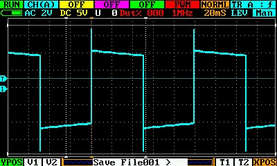

*** How to compile on a Windows Machine ***
-
Choose one option:
-
- Option 1. Download Exe Installer
   - https://sourcery.mentor.com/public/gnu_toolchain/arm-none-eabi/arm-2014.05-28-arm-none-eabi.exe
   - Install the compiler
   - or

- Option 2. Download Standalone archive
   - https://sourcery.mentor.com/public/gnu_toolchain/arm-none-eabi/arm-2014.05-28-arm-none-eabi-i686-mingw32.tar.bz2
   - Extract archive using Winrar 5.21 to C:\arm-2014.05 (don't use 7zip as it creates some empty files):
   - Add C:\arm-2014.05\bin to system PATH

Download DS203 source and extract 
-
- click the green [Clone or download] button on github, then [Download zip]
- Extract the dso203-master.zip somewhere

Open a new Command Prompt Window
-
- in the Command Prompt, CD into /dso203-master/WildcatV6.5 directory with all the source files from above step

Test the compiler
-
- type: arm-none-eabi-gcc.exe -v

Lets build the binary
-
- type: cs-make                                                          
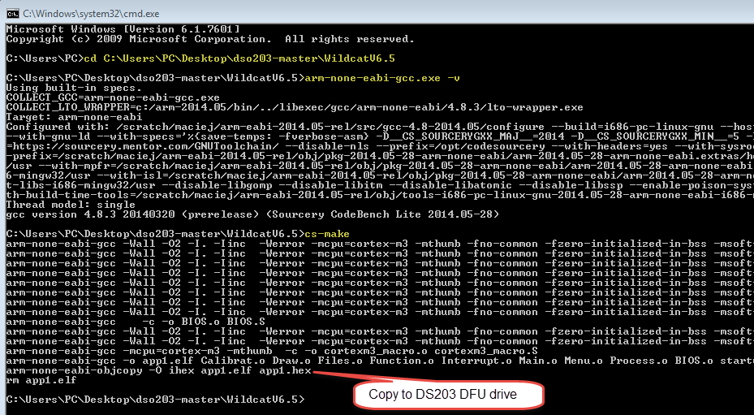

You should find the compiled firmware file app1.hex (428,496 bytes)
-
- Put your DS203 into DFU mode (press and hold >|| button and power on) and copy the app1.hex to the DFU drive.

NOTE:
=
   - If you have WinAVR, cygwin or any other gcc installed, you might get errors.  Use where.exe command to make sure the correct arm-none-eabi-gcc.exe and cc1.exe are being used.
   - Before recompiling type: del *.o 

Optional for HW 2.81 and later DEVICES ONLY
-
To get full speed oversampling, copy FPGA_281.ADR then FPGA_281.BIN in DFU mode to the device.

Screenshots:
-
* A&B trigger mode (using V1 to read frequency of horizontal NTSC video signal sync pulses in cursor defined meter function while simultaneously triggering on sine wave of unrelated frequency)
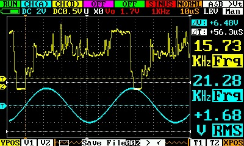

* Cursor defined meter function (using T1 and T2 to read color burst parameters of NTSC video signal):
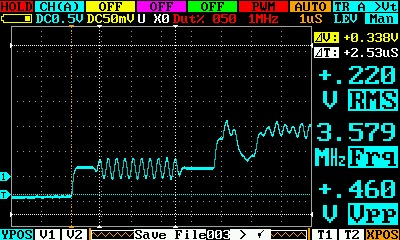

* Persistence mode of RF eye pattern in RAW data mode:        
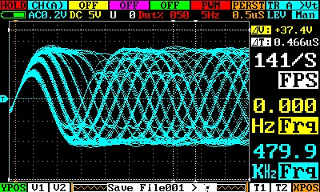

* Persistence mode of a video signal in NORMAL data mode:       
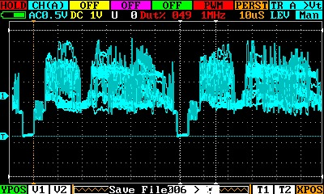

* 30db additional FFT gain with auto scaling:                                  
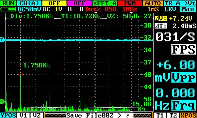

* Voice print of person speaking:                                  
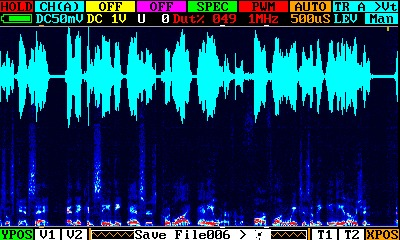

* MAP mode of video frame:                                                                    
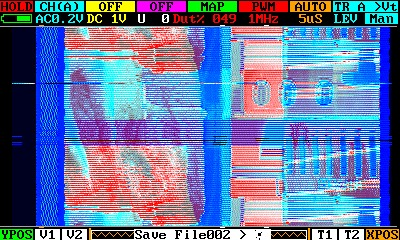

* XY display of stationary pattern in persistence mode:                                  
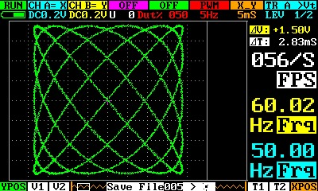

* Frequency spectrum in log mode of 1Khz wave sampled at 720 points from internal generator:
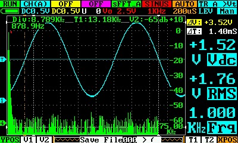

* Frequency scale for spectrograph:                                  
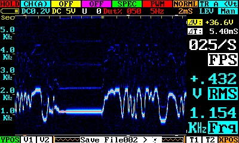

* 2.5-10Khz Frequency response of loudspeaker. Fast sweeps minimize exciting room resonances, allowing reasonably accurate results:                                                                    
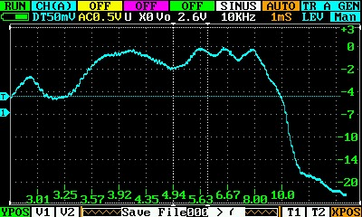

* Tone burst response a loudspeaker:                                  
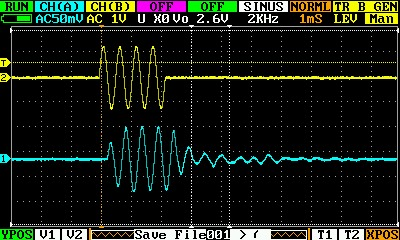

* Quick scan to identify notch filter:                                  
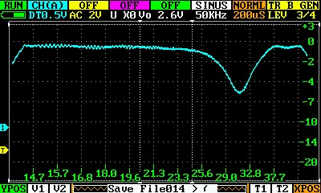

* Expanded scan provides better resolution and proper depth of notch:
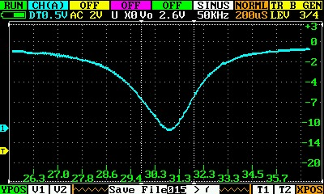

* RS232/TTL serial decoding:                                                                    
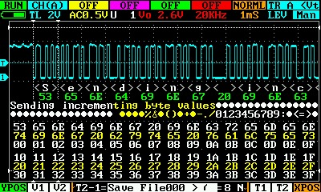

* Arbitrary waveform generator:                                  
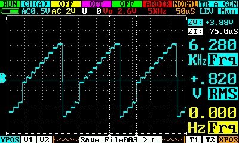

- Credits and contributors:
   - jakub.jelinek
   - Kainer 
   - Wildcat
   - Seeed-Studio
   - Marco Sinatti (marcosin)
   - Gabriel Valky (gabonator1)
   - pmoss69
   - JackTheVendicator
   - bobtidey 
   - JPA 
   - Jerson 
   - original authors minidso
